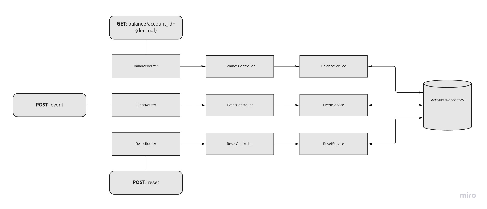

# Simple Bank API

## Code Architecture

    

### Features

- Get balance from an account
- Create an account
- Deposit into an existing account
- Withdraw from an existing account
- Transfer from an existing account
- Reset the state before starting tests

## Endpoints

Get balance from an account:
<pre><code>curl -X 'GET' \
    'http://localhost:3000/balance?account_id=100'
</code></pre>

### Create an account or Deposit into an existing account (if the destination id already exists):
<pre><code>curl -X 'POST' \
    'http://localhost:3000/event' \
    -H 'Content-Type: application/json' \
    -d '{
    "type":"deposit",
    "destination":"100",
    "amount":10
}'
</code></pre>

### Withdraw from an existing account:
<pre><code>curl -X 'POST' \
    'http://localhost:3000/event' \
    -H 'Content-Type: application/json' \
    -d '{
    "type":"withdraw",
    "origin":"100",
    "amount":5
}'
</code></pre>

### Transfer from an existing account:
<pre><code>curl -X 'POST' \
    'http://localhost:3000/event' \
    -H 'Content-Type: application/json' \
    -d '{
    "type":"transfer",
    "origin":"100",
    "amount":15
    "destination":"300"
}'
</code></pre>

### Reset the state before starting tests: 
<pre><code>curl -X 'POST' \
    'http://localhost:3000/reset'
</code></pre>

## Libraries and Tools

- [Node.js](https://nodejs.org/en/)
- [Express](https://expressjs.com/)
- [body-parser](https://www.npmjs.com/package/body-parser)

## Tests

[Node.js](https://nodejs.org/en/) is a prerequisite to run this project. Once its installed on the machine follow the steps below:

- Clone the repository to your machine
- Open a terminal in the containing folder of the project
- Run the command `node index.js`

After this the API should be running on the address `http://localhost:3000`. To test it, you can use your preferred tool for making HTTP requests ([curl](https://curl.se/), [Postman](https://www.postman.com/), etc).

## Limitations and Possible Improvements

- Persistence: As this is a simple implementation to meet the necessary requirements, persistence was not considered during the development. In future versions, it could be a feature to consider implementing.
- Authentication and Authorization: These features were not considered as well, since its a simple implementation. Future versions could expand the functionalities of the API by adding Authentication and Authorization to it.